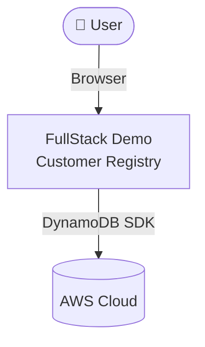
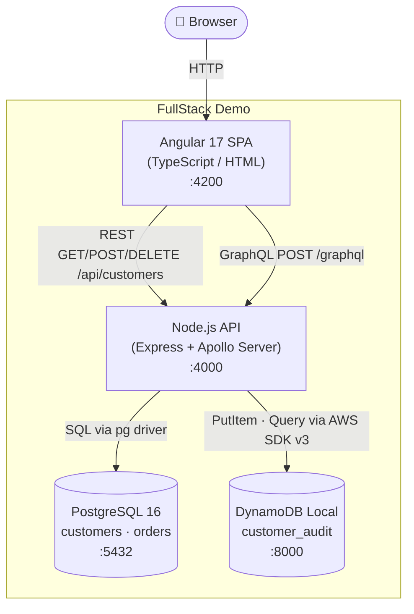
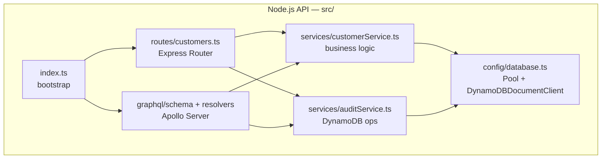

# Architecture — C4 Model

## Level 1 · System Context

## Level 2 · Container Diagram

## Level 3 · Component Diagram (Backend)

## Tech Stack Map

| Topic | Technology | File(s) |
|-------|-----------|---------|
| SDLC | Git + PRs | `.github/` |
| Eng. Standards | ESLint + Prettier | `.eslintrc.json`, `.prettierrc` |
| Architecture | Separation of concerns | `routes/`, `services/`, `config/` |
| C4 Modeling | Mermaid diagrams | `docs/architecture.md` |
| DevOps | GitHub Actions + Docker | `ci.yml`, `Dockerfile`, `docker-compose.yml` |
| JavaScript | Foundation of TS/Node | all `.ts` files compile to JS |
| TypeScript | Strict types throughout | `tsconfig.json`, interfaces, typed params |
| Node.js | Server runtime | `backend/src/index.ts` |
| Angular | Frontend SPA | `frontend/src/app/` |
| Full-Stack | All tiers connected | whole project |
| REST | CRUD API | `backend/src/routes/customers.ts` |
| GraphQL | Flexible query API | `backend/src/graphql/` |
| PostgreSQL | Relational data | `pgPool` in `database.ts` |
| DynamoDB | NoSQL audit log | `auditService.ts` |
| AWS | Cloud target | Docker → deployable to ECS/Lambda |
